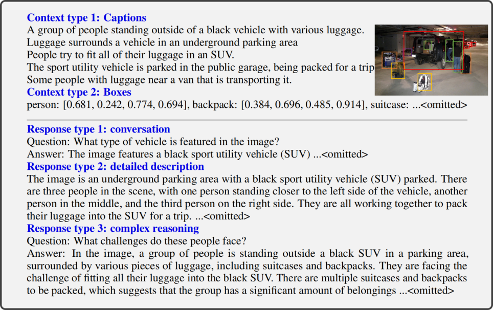
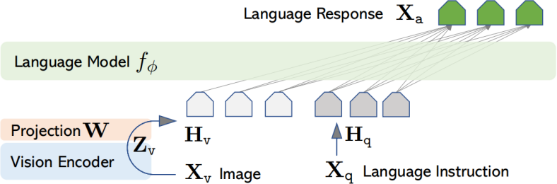
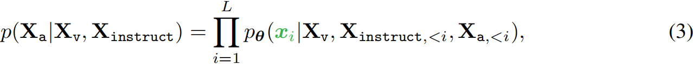
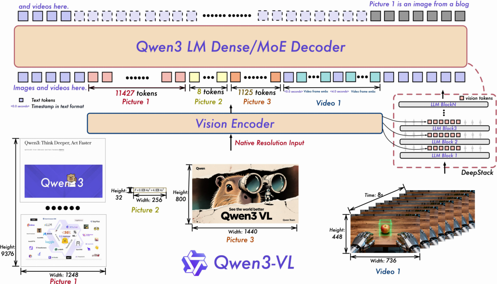

# 第一章 VLM基础学习
## 一、理论知识
### 1. LLaVA
#### 1.1 背景问题
第一，在当前语言增强型基础视觉模型中，任务指令在模型设计中被隐含考虑，语言仅用于描述图像内容，导致了模型通常具有固定的接口，互动性和**遵循用户指令的能力有限**。

第二，最近利用机器生成的高质量指令遵循样本来微调 LLM 大幅提高了 zero-shot 能力，**指令微调尚未在多模态领域进行尝试**。
#### 1.2 解决方法
首次尝试将指令微调拓展至多模态，**提出了视觉指令微调**，利用 GPT-4 将广泛存在的图文对构建成多模态指令遵循数据。



> (指令遵循数据的示例，上半部分展示了用于提示 GPT 的上下文，即标题和方框，下半部分展示了三种类型的响应。请注意，视觉图像不用于提示 GPT，在此仅作为参考展示。)

#### 1.3 模型结构
视觉编码器采用 CLIP(ViT-L/14)，将输入图像 $X_v$ 编码成视觉特征 $Z_v=g(X_v)$。连接器采用一个线性层 $W$，将视觉特征 $Z_v$ 转换为语言嵌入标记 $H_v$。LLM 使用 LLaMA2。



#### 1.4 训练设计
首先，对于每张图像 $X_v$，生成多轮对话数据 $(X_q^1,X_a^1,…,X_q^T,X_a^T)$，其中 $T$ 为总轮数。然后，将它们组织成一个序列，将所有回答视为助手的回复。最后，使用 LLM 原有的自回归训练目标在预测标记上进行指令调优。具体来说，对于长度为 $L$ 的序列，我们通过以下方式计算目标答案的概率 $X_a$:




> (用于训练模型的输入序列，这里仅展示了两轮对话。模型被训练以预测助手的回答以及停止位置，因此在自回归模型中仅使用绿色序列/标记来计算损失。)

我们考虑采用两阶段的指令微调过程训练 LLaVA。

**阶段1：特征对齐预训练**。将 CC3M 过滤为 595K 个图文对，转换成简单的指令数据，每个样本都可以视为单轮对话。$Xinstruct$ 要求模型简要描述图像，真实预测答案 $X_a$ 是原始的图像描述。在训练过程中，仅使用可训练参数 $θ=W$(**连接器**) 最大化公式 (3) 的似然性。

**阶段2：端到端微调**。更新 LLaVA 中**连接器和 LLM** 的预训练权重。
### 2. Qwen3VL
#### 2.1 背景问题
第一，Qwen2-VL 引入了 MRoPE 作为文本和视觉的统一位置编码方案，嵌入维度被划分为时间(t)、水平(h)和垂直(w)子空间，每个子空间被分配了不同的旋转频率。这导致了频率谱的不平衡，影响长视频理解的性能。

第二，受 DeepStack 机制启发：视觉编码器不同层的视觉标记通过轻量级残差连接到相应的 LLM 层，有效利用多层级 ViT 特征，而无需增加额外的上下文长度。

第三，Qwen2.5-VL 采用了与时间同步的 MRoPE 变体来赋予模型时间感知能力。然而：(1)与绝对时间绑定的时间位置 ids，在长视频中过大且稀疏，降低了模型理解长时序上下文的能力。(2)需要在各种帧率下进行广泛且均匀分布的采样，极大地增加了训练数据构建的成本。
#### 2.2 解决方法
第一，采用交错式 MRoPE，在嵌入维度上交错 t、h和w，确保了每个空间-时间轴在低频和高频带中都能得到均匀表示。

第二，集成 DeepStack 机制，从视觉编码器的三种不同层中选取特征，经过连接器的投影，相加到前三个 LLM 层的相应隐藏状态中。

第三，采用了一种基于文本标记的时间编码策略，每个视频时间片段都以格式化的文本字符串形式添加时间戳作为前缀，例如 <3.0秒>。
#### 2.3 模型结构
视觉编码器采用 SigLIP-2，为了适应动态分辨率，采用 2D-RoPE 并根据输入尺寸插值绝对位置嵌入。连接器采用两层 MLP，将视觉编码器输出的 2×2 视觉特征压缩为单个视觉标记，并与 LLM 的隐藏维度对齐，额外的专用模块以支持 DeepStack 机制。LLM 使用 Qwen3。



#### 2.4 训练设计
预训练分为四个阶段，旨在逐步构建从基本对齐到长上下文理解的能力。


值得注意的是，预训练数据包括：

(1)核心数据：图像描述和交错的图文数据，旨在构建通用视觉语言理解的基础模型。

(2)知识：以定义明确的实体为核心构建的大规模预训练数据，涵盖十余种语义类别（包括动物、植物、地标、食物以及车辆、电子产品和服装等日常物品）。旨在使模型具备对现实世界和视觉概念的全面理解。

(3)OCR：OCR、PDF、HTML和Markdown格式数据，旨在提升光学字符识别、文档解析及长文档理解。

(4)视觉定位和计数：基于框的定位、基于点的定位和计数数据，旨在提升模型的定位和定量能力。

(5)空间理解与三维识别：空间理解包括关系标注、功能标签和规划动作查询，三维识别包括单视角相机图像、自然语言指代表达和9自由度3D边界框注释。旨在实现与物理世界的复杂交互。

(6)代码：纯文本编码和多模态编码任务。

(7)视频：时空感知视频理解和视频数据平衡与采样。

(8)科学、技术、工程和数学（STEM）:视觉感知数据、多模态推理数据和语言推理数据。

(9)Agent：函数调用和搜索。

### 3. Lora
读Qwen3VL论文，总结背景问题、解决方法、模型结构、训练设计
## 二、模型实践
### 1.在一个任务上实践Qwen3VL
#### 1.1 分析数据流
**(1)怎样处理输入**

①对于qwen3vl，输入的结构化消息如下。
```python
messages = [
        {
            "role": "user",
            "content": [
                {
                    "type": "image",
                    "image": image,
                },
                {"type": "text", "text": user_text},
            ],
        }
    ]
```
②将结构化消息转换成特定的纯文本字符串。其中，将图像替换为占位符`<|vision_start|><|image_pad|><|vision_end|>`。
```python
text = processor.apply_chat_template(messages, tokenize=False, add_generation_prompt=True)
tokenize=False：返回处理好的字符串，不要将其转换成Token_ID。
add_generation_prompt=True：在字符串末尾添加一个助手起始符<|im_start|>assistant，引导模型输出。
```
输出例如：
```python
<|im_start|>system
You are a helpful assistant.<|im_end|>
<|im_start|>user
<|vision_start|><|image_pad|><|vision_end|>Transcribe the LaTeX of this image.<|im_end|>
<|im_start|>assistant
```
③从结构化消息中提取视觉数据。
```python
image_inputs, video_inputs = process_vision_info(messages)
```
输出例如：
```
<PIL.Image>
```
④将纯文本字符串、视觉数据转换成 Tensor。其中，将文本转换成 Token_ID，将图像缩放、裁剪、归一化……转换成 Tensor。
```python
inputs = processor(text=[text], images=image_inputs, videos=video_inputs, do_resize=True)
```
输出例如：
```python
inputs["input_ids"][0]：文本Token_ID，例如[151644, 8948, 198, ...]，len=37。
                        注意，原本代表图片的占位符文本，在这里已经被替换成了模型专门用于表示图像 Patch 的特定 Token_ID。
inputs["attention_mask"][0]：输入掩码，例如[1, 1, 1, ...]，len=37。
                             用来标记哪些是真实的输入 Token(1)，哪些是为了补齐长度而填充的 Padding Token(0)。
                             注意，在此步骤通常全是 1，后续 DataCollator 中才会出现 0。
inputs["pixel_values"]：纯图像像素 Tensor，例如shape=(32, 1176)。
inputs["image_grid_thw"][0]：记录视觉输入尺寸的三维网格，例如array([1, 4, 8])。
                             其中，T(时间，即帧数，图片为 1)、H(高度的 Patch 数)、W(宽度的 Patch 数)。
inputs['mm_token_type_ids'][0]：多模态Token类型标识，例如[0, ..., 1, ..., 0]，len=37。
                                用来标识每个Token属于那种模态，通常0、1、2分别表示文本、图像、视频模态。
```
**(2)怎样构建标签**

①单独将目标文本转换成 Tensor。
```python
response = tokenizer(f"{output_content}", add_special_tokens=False)
response_input_ids = response["input_ids"]
response_attention_mask = response.get("attention_mask", [1] * len(response_input_ids))
```
②添加结束符`<|im_end|>`，使模型学会输出目标文本后停止。
```python
eos_token_id = tokenizer.eos_token_id
if eos_token_id is not None:
    if not response_input_ids or response_input_ids[-1] != eos_token_id:
        response_input_ids = response_input_ids + [eos_token_id]
        response_attention_mask = response_attention_mask + [1]
```
③将用户输入和目标文本拼接在一起，形成一条完整的对话序列。用`[-100]`把用户输入（题目）掩码，使模型不学习预测这部分。
```python
input_ids = instruction_input_ids + response_input_ids
attention_mask = instruction_attention_mask + response_attention_mask
labels = ([-100] * len(instruction_input_ids) + response_input_ids)
```
**(3)视觉编码器的数据流**

**(4)连接器的数据流**

**(5)LLM的数据流**

**(6)怎样处理输出**

模型输出`logits([batch_size, sequence_length, vocab_size])`，提取序列最后一个位置的输出`logits[:, -1, :]`，经过`argmax`和`tokenizer.decode()`后，将 Token_ID 转换回文本。

**(7)怎样计算损失**

Qwen 采用 Next-Token Prediction（下一个词预测）任务，使用交叉熵损失来计算。实际上，在训练过程中，模型通常可直接计算并输出 loss，无需手动计算损失。
#### 1.2 构建训练流程：只训练连接器、lora训练模型
相关代码在qwen3vl/qwen3vl_ppft和qwen3vl/qwen3vl_lora。
#### 1.3 记录训练信息：训练显存、训练时间、指标结果
(1)零样本推理

(2)只训练连接器

(3)lora训练模型

#### 2.VLM常见问题排查手册
# 第二章 VLM进阶学习计划
## 一、理论知识
### 1. 当前VLM模型的研究方向和进展
### 2. 当前VLM微调的研究方向和进展
