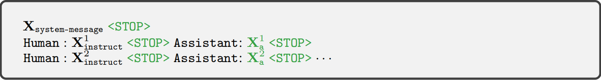
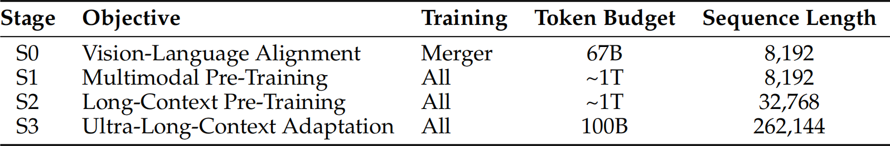
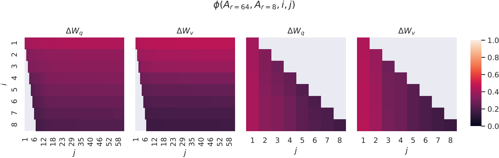
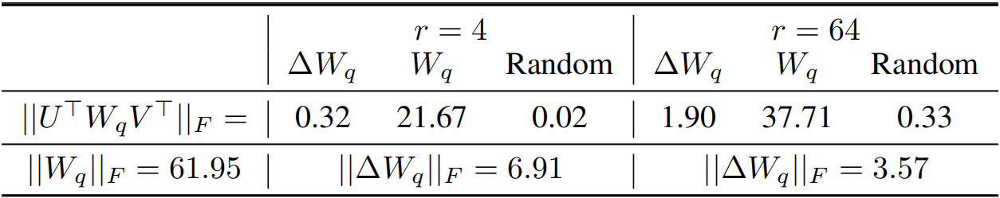

# 第一章 VLM基础学习
## 一、理论知识
### 1. LLaVA
#### 1.1 背景问题
第一，在当前语言增强型基础视觉模型中，任务指令在模型设计中被隐含考虑，语言仅用于描述图像内容，导致了模型通常具有固定的接口，互动性和**遵循用户指令的能力有限**。

第二，最近利用机器生成的高质量指令遵循样本来微调 LLM 大幅提高了 zero-shot 能力，**指令微调尚未在多模态领域进行尝试**。

#### 1.2 解决方法
首次尝试将指令微调拓展至多模态，**提出了视觉指令微调**，利用 GPT-4 将广泛存在的图文对构建成多模态指令遵循数据。

 <!--截图在WPS的Word里，调整好尺寸，×40就是这里的width和height-->

> 指令遵循数据的示例，上半部分展示了用于提示 GPT 的上下文，即标题和方框，下半部分展示了三种类型的响应。请注意，视觉图像不用于提示 GPT，在此仅作为参考展示。

#### 1.3 模型结构
视觉编码器采用 CLIP(ViT-L/14)，将输入图像 $X_v$ 编码成视觉特征 $Z_v=g(X_v)$。连接器采用一个线性层 $W$，将视觉特征 $Z_v$ 转换为语言嵌入标记 $H_v$。LLM 使用 LLaMA2。


#### 1.4 训练设计
首先，对于每张图像 $X_v$，生成多轮对话数据 $(X_q^1,X_a^1,…,X_q^T,X_a^T)$，其中 $T$ 为总轮数。然后，将它们组织成一个序列，将所有回答视为助手的回复。最后，使用 LLM 原有的自回归训练目标在预测标记上进行指令调优。具体来说，对于长度为 $L$ 的序列，我们通过以下方式计算目标答案的概率 $X_a$:




> 用于训练模型的输入序列，这里仅展示了两轮对话。模型被训练以预测助手的回答以及停止位置，因此在自回归模型中仅使用绿色序列/标记来计算损失。

我们考虑采用两阶段的指令微调过程训练 LLaVA。

**阶段1：特征对齐预训练**。将 CC3M 过滤为 595K 个图文对，转换成简单的指令数据，每个样本都可以视为单轮对话。 $X_instruct$ 要求模型简要描述图像，真实预测答案 $X_a$ 是原始的图像描述。在训练过程中，仅使用可训练参数 $θ=W$（**连接器**）最大化公式 (3) 的似然性。

**阶段2：端到端微调**。更新 LLaVA 中**连接器和 LLM** 的预训练权重。

### 2. Qwen3VL
#### 2.1 背景问题
第一，Qwen2-VL 引入了 MRoPE 作为文本和视觉的统一位置编码方案，嵌入维度被划分为时间（t）、水平（h）和垂直（w）子空间，每个子空间被分配了不同的旋转频率。这导致了频率谱的不平衡，影响长视频理解的性能。

第二，受 DeepStack 机制启发：视觉编码器不同层的视觉标记通过轻量级残差连接到相应的 LLM 层，有效利用多层级 ViT 特征，而无需增加额外的上下文长度。

第三，Qwen2.5-VL 采用了与时间同步的 MRoPE 变体来赋予模型时间感知能力。然而：(1)与绝对时间绑定的时间位置 ids，在长视频中过大且稀疏，降低了模型理解长时序上下文的能力。(2)需要在各种帧率下进行广泛且均匀分布的采样，极大地增加了训练数据构建的成本。

#### 2.2 解决方法
第一，采用交错式 MRoPE，在嵌入维度上交错 t、h和w，确保了每个空间-时间轴在低频和高频带中都能得到均匀表示。

第二，集成 DeepStack 机制，从视觉编码器的三种不同层中选取特征，经过连接器的投影，相加到前三个 LLM 层的相应隐藏状态中。

第三，采用了一种基于文本标记的时间编码策略，每个视频时间片段都以格式化的文本字符串形式添加时间戳作为前缀，例如 <3.0秒>。

#### 2.3 模型结构
视觉编码器采用 SigLIP-2，为了适应动态分辨率，采用 2D-RoPE 并根据输入尺寸插值绝对位置嵌入。连接器采用两层 MLP，将视觉编码器输出的 2×2 视觉特征压缩为单个视觉标记，并与 LLM 的隐藏维度对齐，额外的专用模块以支持 DeepStack 机制。LLM 使用 Qwen3。


#### 2.4 训练设计
预训练分为四个阶段，旨在逐步构建从基本对齐到长上下文理解的能力。



值得注意的是，预训练数据包括：

(1)核心数据：图像描述和交错的图文数据，旨在构建通用视觉语言理解的基础模型。

(2)知识：以定义明确的实体为核心构建的大规模预训练数据，涵盖十余种语义类别（包括动物、植物、地标、食物以及车辆、电子产品和服装等日常物品）。旨在使模型具备对现实世界和视觉概念的全面理解。

(3)OCR：OCR、PDF、HTML和Markdown格式数据，旨在提升光学字符识别、文档解析及长文档理解。

(4)视觉定位和计数：基于框的定位、基于点的定位和计数数据，旨在提升模型的定位和定量能力。

(5)空间理解与三维识别：空间理解包括关系标注、功能标签和规划动作查询，三维识别包括单视角相机图像、自然语言指代表达和9自由度3D边界框注释。旨在实现与物理世界的复杂交互。

(6)代码：纯文本编码和多模态编码任务。

(7)视频：时空感知视频理解和视频数据平衡与采样。

(8)科学、技术、工程和数学（STEM）:视觉感知数据、多模态推理数据和语言推理数据。

(9)Agent：函数调用和搜索。

### 3. Lora
#### 3.1 背景问题
随着预训练模型规模的增大，进行全微调变得越来越不可行。现有的方法存在局限：适配器层必须按顺序处理，引入了推理延迟。提示学习效果一般，且缩短了模型可用的序列长度。

#### 3.2 解决方法
在全微调期间，模型初始化为预训练权重，然后通过反复沿梯度方向更新，得到参数 $W_0 + \Delta W$。

之前的研究表明，预训练的语言模型具有较低的“内在维度”（即使随机投影到较小的子空间中，仍能高效学习）。

受此启发，我们假设在适配过程中权重的更新也具有较低的“内在秩”，因此可以通过低秩分解来更新：

$W_0 + \Delta W \rightarrow W_0 + BA$，相应的前向传播过程为： $h = W_0x + \Delta Wx \rightarrow h = W_0x + BAx$。

> 优越性：随着可训练参数量的增加，训练 LoRA 大致收敛于训练原始模型 $\Delta W$，而基于适配器的方法收敛于一个 MLP，基于提示学习的方法则收敛于一个无法处理长输入序列的模型。

#### 3.3 模型结构
在 Transformer 架构中，自注意力模块有四个权重矩阵 $W_q, W_k, W_v, W_o$，MLP 模块有两个。我们在 $W_q, W_k, W_v, W_o$ 中应用 LoRA，MLP 模块被冻结。

> 注意：我们将 $W_q$（或 $W_k$, $W_v$）视为一个维度为 $d_{model} \times d_{model}$ 的矩阵（尽管输出维度通常被切分为注意力头）。

#### 3.4 实验分析
(1)对比实验：在各种模型上与全微调、适配器和提示学习方法对比，LoRA 保持极低的可训练参数量，同时与微调基线持平或更优。

> 注意：前文提到过“随着可训练参数量的增加，训练 LoRA 大致收敛于训练原始模型”。但是，这里为什么 LoRA 会比全微调性能好？可能的原因是较小的秩避免了一些训练噪声，随着秩增大，整体模型更贴近全微调，但是也引入了训练噪声。

(2)理解低秩更新：

(2.1)在 Transformer 中我们应该对哪些权重矩阵应用 LoRA?

在多类型的权重矩阵上应用小秩 LoRA，比在单类型的权重矩阵上应用大秩 LoRA 更可取。

(2.2)适配矩阵真的具有低秩性吗？



> 实验解释：<br>
在同一个预训练模型上，分别使用 $r=8$ 和 $r=64$ 训练了两个 LoRA 模型，提取适配矩阵 $A_{r=8}$ 和 $A_{r=64}$；<br>
对这些矩阵做奇异值分解（SVD），得到按重要性排序的奇异向量；<br>
发现：<br>
$r=8$ 的前几个奇异向量，大部分包含在 $r=64$ 的前几个奇异向量之中（相似度高）。

> 附：奇异值分解（SVD）就是把矩阵分解成一组“方向”并按照重要性排序，例如 $\Delta W = U \Sigma V^T$。其中 $\Sigma$ 是奇异值矩阵（对角矩阵）， $U$ 和 $V^T$ 分别是左/右奇异矩阵（由奇异向量组成）。 $\Sigma$ 的奇异值从大到小排列，奇异值越大，说明对应的奇异向量越重要。

$A_{r=8}$ 和 $A_{r=64}$ 的前几个最重要的奇异向量最相关，而其他方向可能主要包含训练过程中积累的随机噪声。因此，适配矩阵确实可以具有非常低的秩。这表明增加 r 值不能覆盖更有意义的子空间，即低秩的适配矩阵就已足够。此外， $\Delta W_q$ 似乎具有比 $\Delta W_v$ 更高的“内在秩”。

(2.3) $\Delta W$ 与 $W$ 是什么关系?



> 实验解释：<br>
训练 LoRA 模型，提取适配矩阵 $\Delta W_q$ 和原始权重矩阵 $W_q$；<br>
对 $\Delta W_q$ 做 SVD 得到前 $r$ 个奇异向量，用这些奇异向量投影 $W_q$（即对于 LoRA 学习的适配特征，测量它们在原始权重中的强度。）；<br>
对照组：用 $W_q$ 自己的前 $r$ 个奇异向量投影 $W_q$，用随机矩阵的投影 $W_q$；<br>
发现：<br>
对于奇异向量投影值，随机的 ＜ LoRA的 ＜ $W_q$自己的，说明 $\Delta W_q$ 不是随意学习，而是和 $W_q$ 中某些方向相关，但又不是沿着 $W_q$ 最强方向进行学习。<br>
对于 LoRA 的奇异向量投影值 0.32 和 $||\Delta W_q||_F = \mathbf{6.91}$，说明 LoRA 放大了这些方向的强度。

即，低秩适配矩阵可能放大了某些特征，这些特征在通用预训练模型中已学习但未被强调，但在特定下游任务非常重要。

#### 3.5 未来工作
(1)微调或 LoRA 背后的机制还远未清晰：预训练过程中学习的特征是如何被转换，以在下游任务中表现更好的？
我们认为，与全微调相比，LoRA 更便于回答这个问题。

(2)我们主要依靠启发式方法来选择应用 LoRA 的权重矩阵。是否有更合理的方法来实现这一点？

(3) $\Delta W$ 的低秩性表明 $W$ 也可能存在低秩性，这可以为未来的研究提供灵感。

## 二、模型实践
### 1.在一个任务上实践Qwen3VL
#### 1.1 分析数据流
**(1)怎样处理输入**

(1.1)对于qwen3vl，输入的结构化消息如下。
```python
messages = [
        {
            "role": "user",
            "content": [
                {
                    "type": "image",
                    "image": image,
                },
                {"type": "text", "text": user_text},
            ],
        }
    ]
```
(1.2)将结构化消息转换成特定的纯文本字符串。其中，将图像替换为占位符`<|vision_start|><|image_pad|><|vision_end|>`。
```python
text = processor.apply_chat_template(messages, tokenize=False, add_generation_prompt=True)
tokenize=False：返回处理好的字符串，不要将其转换成Token_ID。
add_generation_prompt=True：在字符串末尾添加一个助手起始符<|im_start|>assistant，引导模型输出。
```
输出例如：
```python
<|im_start|>system
You are a helpful assistant.<|im_end|>
<|im_start|>user
<|vision_start|><|image_pad|><|vision_end|>Transcribe the LaTeX of this image.<|im_end|>
<|im_start|>assistant
```
(1.3)从结构化消息中提取视觉数据。
```python
image_inputs, video_inputs = process_vision_info(messages)
```
输出例如：
```
<PIL.Image>
```
(1.4)将纯文本字符串、视觉数据转换成 Tensor。其中，将文本转换成 Token_ID，将图像缩放、裁剪、归一化……转换成 Tensor。
```python
inputs = processor(text=[text], images=image_inputs, videos=video_inputs, do_resize=True)
```
输出例如：
```python
inputs["input_ids"][0]：文本Token_ID，例如[151644, 8948, 198, ...]，len=37。
                        注意，原本代表图片的占位符文本，在这里已经被替换成了模型专门用于表示图像 Patch 的特定 Token_ID。
inputs["attention_mask"][0]：输入掩码，例如[1, 1, 1, ...]，len=37。
                             用来标记哪些是真实的输入 Token(1)，哪些是为了补齐长度而填充的 Padding Token(0)。
                             注意，在此步骤通常全是 1，后续 DataCollator 中才会出现 0。
inputs["pixel_values"]：纯图像像素 Tensor，例如shape=(32, 1176)。
inputs["image_grid_thw"][0]：记录视觉输入尺寸的三维网格，例如array([1, 4, 8])。
                             其中，T(时间，即帧数，图片为 1)、H(高度的 Patch 数)、W(宽度的 Patch 数)。
inputs['mm_token_type_ids'][0]：多模态Token类型标识，例如[0, ..., 1, ..., 0]，len=37。
                                用来标识每个Token属于那种模态，通常0、1、2分别表示文本、图像、视频模态。
```

**(2)怎样构建标签**

(2.1)单独将目标文本转换成 Tensor。
```python
response = tokenizer(f"{output_content}", add_special_tokens=False)
response_input_ids = response["input_ids"]
response_attention_mask = response.get("attention_mask", [1] * len(response_input_ids))
```
(2.2)添加结束符`<|im_end|>`，使模型学会输出目标文本后停止。
```python
eos_token_id = tokenizer.eos_token_id
if eos_token_id is not None:
    if not response_input_ids or response_input_ids[-1] != eos_token_id:
        response_input_ids = response_input_ids + [eos_token_id]
        response_attention_mask = response_attention_mask + [1]
```
(2.3)将用户输入和目标文本拼接在一起，形成一条完整的对话序列。用`[-100]`把用户输入（题目）掩码，使模型不学习预测这部分。
```python
input_ids = instruction_input_ids + response_input_ids
attention_mask = instruction_attention_mask + response_attention_mask
labels = ([-100] * len(instruction_input_ids) + response_input_ids)
```

**(3)视觉编码器的数据流**

**(4)连接器的数据流**

**(5)LLM的数据流**

**(6)怎样处理输出**

模型输出`logits([batch_size, sequence_length, vocab_size])`，提取序列最后一个位置的输出`logits[:, -1, :]`，经过`argmax`和`tokenizer.decode()`后，将 Token_ID 转换回文本。

**(7)怎样计算损失**

Qwen 采用 Next-Token Prediction（下一个词预测）任务，使用交叉熵损失来计算。实际上，在训练过程中，模型通常可直接计算并输出 loss，无需手动计算损失。

#### 1.2 构建训练流程：只训练连接器、lora训练模型
相关代码在`qwen3vl/qwen3vl_ppft`和`qwen3vl/qwen3vl_lora`。

#### 1.3 记录训练信息：训练显存、训练时间、指标结果
```python
训练信息
data_dir："../../Datas/LaTeX_OCR/human_handwrite_print_format"
train_fraction：0.5
test_fraction：1.0
per_device_train_batch_size：8
learning_rate：1e-4
num_train_epochs:5

lora信息
lora微调模型的参数：["q_proj", "k_proj", "v_proj", "o_proj"]
lora_rank：32
lora_alpha：64
lora_dropout：0

ppft信息
可训练参数关键词列表：["visual.merger"]
```
| 方法 | 训练显存 | 训练时间 | 测试集损失(最好) |
| :--- | :--- | :--- | :--- |
| qwen2.5vl_lora | 15360 M | 347.3 s | 0.001902 |
| qwen2.5vl_ppft | 15106 M | 302.5 s | 0.004046 |
| qwen3vl_lora | 17320 M | 1037.0 s | 0.001897 |
| qwen3vl_ppft | 17090 M | 1078.0 s | 0.002189 |

#### 2.VLM常见问题排查手册

# 第二章 VLM进阶学习计划
## 一、理论知识
### 1. 当前VLM模型的研究方向和进展
### 2. 当前VLM微调的研究方向和进展
