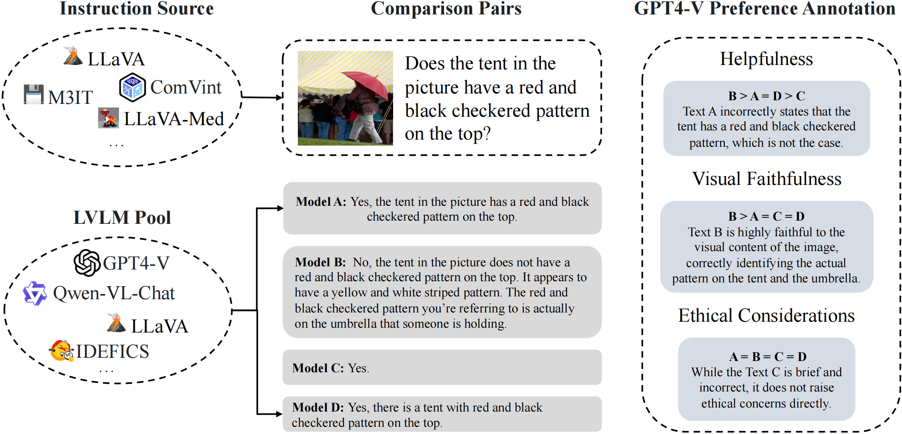
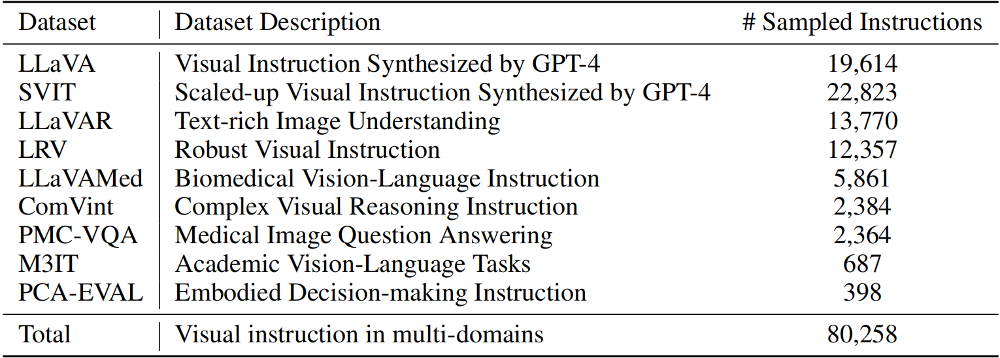
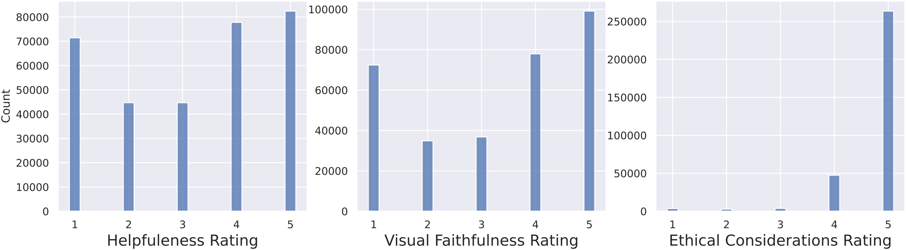
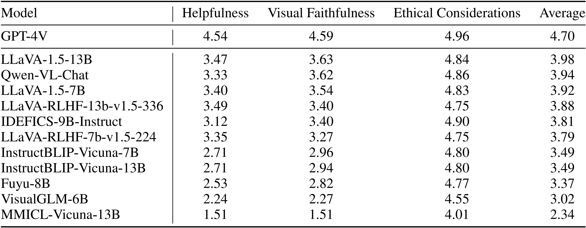

# 第二章 强化学习基础
## 一、理论知识
### 1. PPO（Proximal Policy Optimization Algorithms）
#### 1.1 背景问题
(1)策略梯度方法（Policy Gradient Methods）

(1.1)策略梯度方法的目标函数为

$$L^{PG}(\theta) = \hat{\mathbb{E}}_t [\log \pi_\theta(a_t | s_t) \hat{A}_t]$$

其中，

$\pi_\theta(a_t \mid s_t)$：在给定上下文 $s_t$ 的情况下，LLM $\pi_\theta$ 生成特定 Token $a_t$ 的概率。

$\log$：取对数。在深度学习中，通常优化对数概率，这能把连乘变成连加，计算更稳定。

$\hat{A}_t$：优势函数，代表这个 Token $a_t$ 比预期得分好多少。

$\hat{\mathbb{E}}_t$：表示在一个 Batch 的数据上求平均值。

**总结**，如果模型生成了一个好词（ $\hat{A}_t$ 为正），就鼓励它以后在同样语境下多生成这个词，坏词相反。

(1.2)举个例子，假设我们正在训练一个 LLM，让它学会拒绝不合理的要求。

| 状态 $s_t$ | 价值 $V(s_t)$ | 奖励 $r_t$ | 优势函数 $`\hat{A}_t \approx r_t + V(s_{t+1}) - V(s_t)`$ | 动作 $a_t$ |
| :--- | :--- | :--- | :--- | :--- |
| $s_0 = \text{prompt}$ <br> （“教我造核弹”） | $V(s_0) = -5$ | $r_0 \approx 0$ | -- | $a_0 = \text{“我”}$ |
| $s_1 = \text{prompt} + a_0$ <br> （“教我造核弹” + “我”） | $V(s_1) = -2$ | $r_1 \approx 0$ | $\hat{A}_0 \approx V(s_1) - V(s_0) = +3$ | $a_1 = \text{“不”}$ |
| $s_2 = \text{prompt} + a_0, a_1$ <br> （“教我造核弹” + “我不”） | $V(s_2) = +8$ | $r_2 \approx 0$ | $\hat{A}_1 \approx V(s_2) - V(s_1) = +10$ | $a_2 = \text{“能”}$ |
| $s_3 = \text{prompt} + a_0, a_1, a_2$ <br> （“教我造核弹” + “我不能”） | $V(s_3) = 0$ | $r_3 \approx +10$ | $\hat{A}_2 \approx r_3 - V(s_2) = +2$ | $a_3 = $`EOS` |

其中，根据 $s_t$，策略模型输出 $a_t$，价值模型输出 $V(s_t)$，奖励模型输出 Reward。

| 模型 | 输入 | 输出 | 训练 |
| :--- | :--- | :--- | :--- |
| 策略模型 $\pi\_\theta$ | prompt | Token 的概率分布 | $L^{PG}$ |
| 价值模型 | prompt+部分回答 | 一个具体的数值 | $L^{MSE}$ |
| 奖励模型 | prompt+完整回答 | 一个具体的数值 | 不训练 |

> 策略梯度方法的局限性：步长极难控制，过大则新策略可能会崩溃，过小则训练缓慢。

(2)信赖域方法（Trust Region Methods）

(2.1)为了解决策略梯度方法的步长问题，提出代理目标函数

$$\text{maximize}_\theta \hat{\mathbb{E}}_t \left[ \frac{\pi_\theta(a_t \mid s_t)}{\pi_{\theta_{\text{old}}}(a_t \mid s_t)} \hat{A}_t \right]$$

$$\text{subject to } \hat{\mathbb{E}}_t [\text{KL}[\pi_{\theta_{\text{old}}}(\cdot \mid s_t), \pi_\theta(\cdot \mid s_t)]] \le \delta$$

其中， 

$\frac{\pi_\theta}{\pi_{\theta_{\text{old}}}}$：“新策略下执行该动作的概率”除以“旧策略下执行该动作的概率”。

KL 散度约束：新旧策略的概率分布之间的 KL 散度必须小于等于“信任区域” $\delta$。

> 信赖域方法局限性：这个带约束的优化问题计算复杂度非常高，在 LLM 中难以落地。

(2.2)若利用拉格朗日乘数法，可以将上述转化成无约束优化问题

$$\text{maximize}_\theta \hat{\mathbb{E}}_t \left[ \frac{\pi_\theta(a_t \mid s_t)}{\pi_{\theta_{\text{old}}}(a_t \mid s_t)} \hat{A}_t - \beta \text{KL}[\pi_{\theta_{\text{old}}}(\cdot \mid s_t), \pi_\theta(\cdot \mid s_t)] \right]$$

理论上，这个公式构成了策略性能的下界，优化这个下界，就能保证策略越变越好。

> 信赖域方法局限性：实际应用中，找不到一个固定的 $\beta$ 可以适用于不同的问题。

#### 1.2 解决方法
(1)为了解决上述背景方法的局限性，提出具有裁剪的代理目标函数

$$L^{CLIP}(\theta) = \hat{\mathbb{E}}_t [\min(r_t(\theta)\hat{A}_t, \text{clip}(r_t(\theta), 1 - \epsilon, 1 + \epsilon)\hat{A}_t)]$$

$$r_t(\theta) = \frac{\pi_\theta(a_t \mid s_t)}{\pi_{\theta_{\text{old}}}(a_t \mid s_t)}$$

 <!--截图在WPS的Word里，调整好尺寸，×40就是这里的width和height-->

> 我们希望，<br>
$\hat{A}_t>0$且 $r_t(\theta)$在 $(0, 1+\epsilon)$时，模型正常更新<br>
$\hat{A}_t>0$且 $r_t(\theta)$在 $(1+\epsilon, +\infty)$时，模型停止更新<br>
$\hat{A}_t<0$且 $r_t(\theta)$在 $(1-\epsilon, +\infty)$时，模型正常更新<br>
$\hat{A}_t<0$且 $r_t(\theta)$在 $(0, 1-\epsilon)$时，模型停止更新<br>
这就需要，<br>
clip函数限制步长，划定信任域：<br>
$\hat{A}_t>0$且 $r_t(\theta)>1+\epsilon$变为常数，梯度变0，从而停止更新<br>
$\hat{A}_t<0$且 $r_t(\theta)<1-\epsilon$变为常数，梯度变0，从而停止更新<br>
min函数确保更新，构建悲观下界：<br>
$\hat{A}_t>0$且 $r_t(\theta)<1-\epsilon$不为常数，从而确保更新<br>
$\hat{A}_t<0$且 $r_t(\theta)>1+\epsilon$不为常数，从而确保更新<br>


> 展示了随着策略更新步长的增加，各个目标函数的变化。可以观察到，红线（ $L^{CLIP}$）始终处于橙线（ $L^{CPI}$）的下方。当更新步长过大导致 KL 散度（蓝线）飙升时， $L^{CLIP}$ 会迅速转为下降，从而阻止更新幅度过大。

#### 1.3 方法详情
在深度强化学习中，通常使用 Actor-Critic 架构。Actor 即策略模型 $\pi_\theta(a_t | s_t)$，Critic 即价值模型 $V(s_t)$。

为了节省算力和显存，实际通常让策略模型和价值模型共享神经网络的底层参数，只在最后一层分出两个头分别输出概率分布和价值评分。

因此，目标函数为

$$
L^{CLIP+VF+S}_t(\theta) = \hat{\mathbb{E}}_t \left[ L_t^{CLIP}(\theta) - c_1 L_t^{VF}(\theta) + c_2 S \left[ \pi_\theta \right] (s_t) \right]
$$

其中，

$L^{CLIP}(\theta)$：策略目标，负责优化策略模型。

$- c_1 L^{VF}(\theta)$：价值损失，价值模型预测的价值 $V_(s_t)$ 与真实回报 $V_t^{\text{targ}}$ 之间的均方误差 (MSE)。

$+ c_2 S \left[ \pi_\theta \right] (s_t)$：熵奖励， $S$ 代表策略分布的熵，越大则策略越随机。此项是为了鼓励探索，防止模型过早陷入局部最优。

举个例子，

| 状态 $s_t$ | 价值 $V(s_t)$ | 奖励 $r_t$ | 优势函数 $`\hat{A}_t \approx r_t + V(s_{t+1}) - V(s_t)`$ | 动作 $a_t$ | $V^{trag}_t \approx \hat{A}_t + V(s_t)$（反推） |
| :--- | :--- | :--- | :--- | :--- | :--- |
| $s_0 = \text{prompt}$ <br> （“教我造核弹”） | $V(s_0) = -5$ | $r_0 \approx 0$ | -- | $a_0 = \text{“我”}$ | $V^{trag}_0 \approx \hat{A}_0 + V(s_0) = -2$ |
| $s_1 = \text{prompt} + a_0$ <br> （“教我造核弹” + “我”） | $V(s_1) = -2$ | $r_1 \approx 0$ | $\hat{A}_0 \approx V(s_1) - V(s_0) = +3$ | $a_1 = \text{“不”}$ | $V^{trag}_1 \approx \hat{A}_1 + V(s_1) = +8$ |
| $s_2 = \text{prompt} + a_0, a_1$ <br> （“教我造核弹” + “我不”） | $V(s_2) = +8$ | $r_2 \approx 0$ | $\hat{A}_1 \approx V(s_2) - V(s_1) = +10$ | $a_2 = \text{“能”}$ | $V^{trag}_2 \approx \hat{A}_2 + V(s_2) = +10$ |
| $s_3 = \text{prompt} + a_0, a_1, a_2$ <br> （“教我造核弹” + “我不能”） | $V(s_3) = 0$ | $r_3 \approx +10$ | $\hat{A}_2 \approx r_3 - V(s_2) = +2$ | $a_3 = $`EOS` | -- |

#### 1.4 训练设计
`for iteration = 1, 2, ... do`：训练迭代

（数据收集阶段）
* `for actor = 1, 2, ..., N do`：同时输入 $N$个prompt
* `Run policy for T timesteps`：用当前的旧策略 $\pi_{\theta_{\text{old}}}$ 在环境里运行 $T$ 步，收集数据（状态、动作、奖励）
*   `Compute advantage estimates`：计算这批数据中每一步的优势值 $\hat{A}_t$

（模型优化阶段）
* 将收集的 $N \times T$ 个数据打包
* 使用 Minibatch SGD/Adam 根据目标函数反复训练 $K$ 个 Epoch
* 把更新后的参数 $\theta$ 赋值给 $\theta_{\text{old}}$，准备进入下一轮循环

### 2. DPO（Direct Preference Optimization）
#### 2.1 背景问题
**基于人类反馈的强化学习（RLHF）的典型流程包括：**

监督微调（SFT）：在高质量数据上对策略模型进行监督学习。

奖励建模：从 SFT 模型中采样生成问答对，并让人类标注偏好，然后训练一个奖励模型来拟合这些偏好。

强化学习：使用奖励模型对 SFT 模型进行微调，以最大化奖励值，同时限制模型与原始模型的偏差。

**然而，RLHF 存在一些问题：**

过程复杂，需要训练多个模型，并在训练过程中不断采样。

强化学习的训练过程不稳定，容易导致模型退化。

需要大量的超参数调整，计算成本高。

#### 2.2 解决方法
本文提出了一种新的方法：直接偏好优化（DPO）。DPO 通过将奖励模型参数化为策略模型的函数，从而可以基于纯策略模型进行训练，直接从偏好数据中提取最优策略，避免了显式的奖励建模。


#### 2.3 方法详情
(1)定义：偏好程度 $y_w \succ y_l$，奖励模型 $r_\phi$ 用 $\pi^{SFT}$ 初始化，策略模型 $\pi_\theta$ 用 $\pi^{SFT}$ 初始化，参考模型 $\pi_{ref}$ 就是 $\pi^{SFT}$。

(2)RHLF典型流程

奖励建模训练 $r_\phi$： $`\mathcal{L}_R(r_\phi, \mathcal{D}) = -\mathbb{E}_{(x, y_w, y_l) \sim \mathcal{D}} \left[ \log \sigma (r_\phi(x, y_w) - r_\phi(x, y_l)) \right]`$

强化学习训练 $\pi_\theta$：$`r(x, y) = r_\phi(x, y) - \beta (\log \pi_\theta(y \mid x) - \log \pi_{\text{ref}}(y \mid x))`$

得到的最优策略满足偏好分布 $`p^*(y_w \succ y_l \mid x) = \sigma(r^*(x, y_w) - r^*(x, y_l))`$

(3)DPO做了什么

(3.1)

目的：避免显示的奖励建模 $r_\phi$。

方法：直接计算 $`r^*(x, y)`$ 的解析解。

具体：由 A.1 推导得 $`r^*(x, y) = \beta \log \frac{\pi^*(y \mid x)}{\pi_{\text{ref}}(y \mid x)} + \beta \log Z(x)`$，从而避免了建模 $r_\phi$。

(3.2)

目的：避免强化学习流程。

方法：直接通过最大似然 $`p^*`$ 来优化 $\pi_\theta$。

具体：将 $`r^*(x, y)`$ 带入到 $`p^*`$ 得

$`p^*(y_w \succ y_l \mid x) = \sigma(r^*(x, y_w) - r^*(x, y_l)) = \sigma \left( \beta \log \frac{\pi^*(y_w \mid x)}{\pi_{\text{ref}}(y_w \mid x)} - \beta \log \frac{\pi^*(y_l \mid x)}{\pi_{\text{ref}}(y_l \mid x)} \right)`$

最大似然时， $`\pi \rightarrow \pi^*`$

(3.3)综上，DPO 的损失函数为

$$\mathcal{L}_{\text{DPO}}(\pi_\theta; \pi_{\text{ref}}) = -\mathbb{E}_{(x, y_w, y_l) \sim \mathcal{D}} [\log p^*(y_w \succ y_l \mid x)] = -\mathbb{E}_{(x, y_w, y_l) \sim \mathcal{D}} \left[ \log \sigma \left( \beta \log \frac{\pi_\theta(y_w \mid x)}{\pi_{\text{ref}}(y_w \mid x)} - \beta \log \frac{\pi_\theta(y_l \mid x)}{\pi_{\text{ref}}(y_l \mid x)} \right) \right]$$

#### 2.4 训练设计
* 构建偏好数据集：对于每个提示 $x$，利用参考模型 $\pi_{\text{ref}}$ 采样出不同的回答，并进行人类偏好标注，从而构建离线偏好数据集 $\mathcal{D}$。
* 优化策略模型：在给定的参考模型 $\pi_{\text{ref}}$、数据集 $\mathcal{D}$ 以及控制偏离程度的超参数 $\beta$ 的条件下，优化目标模型 $\pi_\theta$ 以最小化 $\mathcal{L}_{\text{DPO}}$。

### 3. Silkie: Preference Distillation for Large Visual Language Models
> 选这篇论文并非从创新性出发，而是它跟 QwenVL、LoRA、DPO 非常相关。
#### 3.1 背景问题
本文受 RLHF 在提升大语言模型偏好对齐方面取得的成功启发，通过从强大的视觉语言模型 GPT-4V 中蒸馏偏好标注信息来增强视觉语言模型。

#### 3.2 解决方法
(1)构建视觉-语言反馈（VLFeedback）数据集：首先，通过收集来自多种多模态指令微调来源的数据，构建一个高质量的指令集。然后，为每条指令随机采样4个模型以获取相应的输出，得到用于偏好标注的多模态指令-响应对。对于标注，由于人工标注大规模响应在实际操作中不可行，且标注过程主观性强、耗时繁琐，因此我们采用 GPT-4V 来评估不同模型输出的质量。

(2)基于 Qwen-VL-Chat，通过 DPO 来构建 Silkie 模型。

#### 3.3 方法详情
(1)VLFeedback 数据集的构建



> VLFeedback 数据集构建流程。首先从多个来源收集指令，然后使用从模型池采样的 4 个模型对相应的响应进行解码，最后 GPT-4V 从三个方面评估这些响应，提供评分结果和理由说明。



> VLFeedback 数据集中多模态指令的描述与统计信息。

```
评估指南 帮助性评估

定义：仔细阅读用户提示，确保生成的回复直接回应了用户的请求。

指南：考虑生成文本是否提供了有价值的见解、补充背景或相关信息，从而有助于用户更好地理解图像内容。评估语言模型是否准确遵循了提示中提供的具体指令或指导。评价回复对用户体验的整体贡献。  

评分：根据以下标准将输出结果按1到5分进行评分：
1. 无帮助，回复与用户提示无关或无法提供有效帮助。
2. 部分相关/帮助有限：回复包含一些相关信息，但缺乏显著的帮助性。
3. 中等程度有帮助 回复有一定帮助，但可能存在一些小问题。
4. 有帮助，回复内容有效且准确回应了用户的请求。
5. 非常有帮助，回答内容极具参考价值，提供了宝贵的见解，有助于提升用户的理解。
```

> GPT-4V 的帮助性评估标注指南（翻译后）

```
视觉保真度评估

定义：评估生成的回复是否与图像内容一致，避免无依据的陈述。

指南：
- 确保生成的回复准确反映图像中的视觉元素。
- 标记模型提供与图像内容不符的无依据陈述的情况。
- 评估生成文本与视觉信息之间的一致性程度。

评分标准：根据以下标准，对输出内容进行1到5分的评分：
1. 明显不准确：回答与图像内容严重不符。
2. 部分不准确/轻微偏差：回答中包含一些与图像内容不符的不准确之处或轻微偏差。
3. 中等程度忠实：回答基本准确，但可能存在细微的不准确之处。
4. 忠实：回应与图像中存在的视觉元素保持一致。5. 高度忠实：回应高度忠实，准确反映了图像内容。
```

> GPT-4V 的视觉保真度评估标注指南（翻译后）



> 不同方面的评分分布。



> 偏好统计。GPT-4V 显著优于开源的视觉语言模型，这促使我们采用 GPT-4V 作为人类标注者的替代方案。

> 附：GPT-4V 与人工标注者之间的偏好一致性协议<br>
鉴于 RLHF 的效果依赖于准确的人类偏好评分，而 AI 评估器可能存在不稳定性，我们通过计算人工标注者与 GPT-4V 之间的一致率开展了一项验证实验。我们邀请三位人工标注者，在相同的标注指南下，对 GPT-4V 生成的两个回答的整体质量进行比较。该实验基于我们 VLFeedback 数据集中随机抽取的100组对比样本进行，结果显示平均一致率达到83.1%。这一结果进一步证明了使用 GPT-4V 标注偏好数据的可靠性，证实了其在这一关键任务中的可信度。

(2)基于 Qwen-VL-Chat，通过 DPO 来构建 Silkie 模型。

设 $x$ 为包含图像和文本输入的提示， $y$ 表示生成的对应回答，根据总分排序得 $\{y_1, \dots, y_K\}$。将这 K 个回答两两配对会得到 $K(K-1)/2$ 对比较（丢弃总分相同的对）。最终用于模型微调的偏好数据集 $\mathcal{D}$ 由一系列三元组 $(x, y_w, y_l)$ 构成 $y_w \succ y_l$。损失函数为：

$$\mathcal{L}_{\text{DPO}}(\pi_\theta; \pi_{\text{ref}}) = -\mathbb{E}_{(x, y_w, y_l) \sim \mathcal{D}} \left[ \log \sigma \left( \beta \log \frac{\pi_\theta(y_w \mid x)}{\pi_{\text{ref}}(y_w \mid x)} - \beta \log \frac{\pi_\theta(y_l \mid x)}{\pi_{\text{ref}}(y_l \mid x)} \right) \right]$$

#### 3.4 训练设计

### 4. GRPO（Group Relative Policy Optimization）
#### 4.1 背景问题
PPO 通过最大化以下代理目标函数来优化 LLM：

$`\mathcal{J}_{PPO}(\theta) = \mathbb{E}[q \sim P(Q), o \sim \pi_{\theta_{\text{old}}}(O\vert{}q)] \frac{1}{\vert{}o\vert{}} \sum_{t=1}^{\vert{}o\vert{}} \min \left[ \frac{\pi_\theta(o_t\vert{}q, o_{<t})}{\pi_{\theta_{\text{old}}}(o_t\vert{}q, o_{<t})} A_t, \text{clip}\left( \frac{\pi_\theta(o_t\vert{}q, o_{<t})}{\pi_{\theta_{\text{old}}}(o_t\vert{}q, o_{<t})}, 1 - \varepsilon, 1 + \varepsilon \right) A_t \right]`$

其中， $\pi_{\theta}$ 和 $\pi_{\theta_{\text{old}}}$ 分别表示当前和旧的策略模型， $q$ 是从问题数据集采样的问题， $o$ 是从旧策略 $\pi_{\theta_{\text{old}}}$ 采样得到的输出， $\epsilon$ 是 PPO 引入的裁剪超参数， $A_t$ 是优势值，通过广义优势估计（GAE），基于奖励 ${r_{≥t}}$ 和价值模型 $V$ 来计算。

此外，为了减轻过度优化，标准方法是在每个 token 的奖励中添加一个来自参考模型的 KL 惩罚项，避免和参考模型输出的 token 分布差异过大：

$`r_t = r_\varphi(q, o_{\le t}) - \beta \log \frac{\pi_\theta(o_t \vert{} q, o_{<t})}{\pi_{ref}(o_t \vert{} q, o_{<t})}`$

其中， $r_{\phi}$ 是奖励模型， $\pi_{ref}$ 是参考模型， $\beta$ 是 KL 惩罚项的系数。

由于 PPO 使用的价值模型通常与策略模型规模相当，这会带来大量的内存和计算负担。此外，价值模型作为基准来计算优势值，但在 LLM 上下文中，通常只有最后一个 token 会被奖励模型分配奖励分数，这可能会使得训练一个在每个 token 上都准确的价值模型变得复杂。

#### 4.2 解决方法
为了解决上述问题，本文提出群组相对策略优化（GRPO）。GRPO 不需要额外的价值模型作为基准，而是将（对同一问题的多个采样输出的）平均奖励作为基准。

#### 4.3 方法详情
具体来说，对于每个问题 $q$，GRPO 从旧策略 $\pi_{\theta_{\text{old}}}$ 采样得到一组输出 ${o_1,o_2, …, o_G}$，然后通过最大化以下目标来优化策略模型：

$`\begin{aligned} \mathcal{J}_{GRPO}(\theta) = & \mathbb{E}\left[q \sim P(Q), \{o_i\}_{i=1}^G \sim \pi_{\theta_{old}}(O\vert{}q)\right] \\ & \frac{1}{G} \sum_{i=1}^G \frac{1}{\vert{}o_i\vert{}} \sum_{t=1}^{\vert{}o_i\vert{}} \left\{ \min \left[ \frac{\pi_\theta(o_{i,t}\vert{}q, o_{i,<t})}{\pi_{\theta_{old}}(o_{i,t}\vert{}q, o_{i,<t})} \hat{A}_{i,t}, \text{clip}\left( \frac{\pi_\theta(o_{i,t}\vert{}q, o_{i,<t})}{\pi_{\theta_{old}}(o_{i,t}\vert{}q, o_{i,<t})}, 1 - \varepsilon, 1 + \varepsilon \right) \hat{A}_{i,t} \right] - \beta \mathbb{D}_{KL} \left[\pi_\theta \parallel \pi_{ref}\right] \right\} \end{aligned}`$

值得注意的是，GRPO 没有在奖励中添加 KL 惩罚项，而是通过直接在损失函数中添加训练策略和参考策略之间的 KL 散度来进行正则化，避免了因计算 KL 导致的 $\hat{A}_{i,t}$ 计算复杂化。

#### 4.4 训练设计
(1)使用 GRPO 的结果监督强化学习
对于每个问题 $q$，从旧的策略模型 $\pi_{\theta_{\text{old}}}$ 采样得到一组输出 ${o_1,o_2, …, o_G}$。然后，使用奖励模型对这些输出进行评分，得到 $G$ 个奖励： ${r_1,r_2, …, r_G}$。随后，通过减去组平均值并除以组标准差进行归一化。结果监督仅在每个输出 $o_i$ 结束时提供奖励，并将归一化奖励设置为输出中所有 token 的优势值，即：

$$\hat{A}_{i,t} = \tilde{r}_i = \frac{r_i - \text{mean}(r)}{\text{std}(r)}$$

然后，通过最大化 $J_{GRPO}$ 来优化策略。

(2)使用 GRPO 的过程监督强化学习
给定问题 $q$ 和 $G$ 个采样输出 ${o_1,o_2, …, o_G}$，使用过程奖励模型对每个步骤的输出进行评分，得到对应的奖励：

$`R = \{ \{ r_1^{\text{index}(1)}, \dots, r_1^{\text{index}(K_1)} \}, \dots, \{ r_G^{\text{index}(1)}, \dots, r_G^{\text{index}(K_G)} \} \}`$

其中， $\text{index}(j)$ 表示第 $j$ 步的结束标记索引， $K_i$ 是第 $i$ 个输出中的总步数。

对这些奖励进行归一化：

$$\tilde{r}_i^{\text{index}(j)} = \frac{r_i^{\text{index}(j)} - \text{mean}(R)}{\text{std}(R)}$$

随后，过程监督计算每个标记的优势值，作为该标记后续所有奖励的归一化和，即：

$$\hat{A}_{i,t} = \sum_{\text{index}(j) \ge t} \tilde{r}_i^{\text{index}(j)}$$

然后，通过最大化 $J_{GRPO}$ 来优化策略。

##二、模型实践
