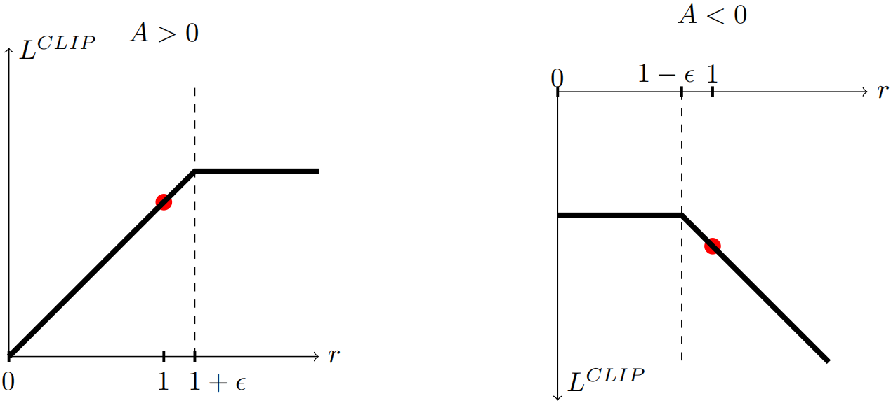
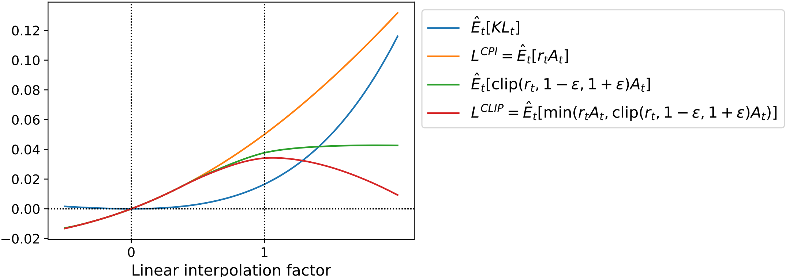
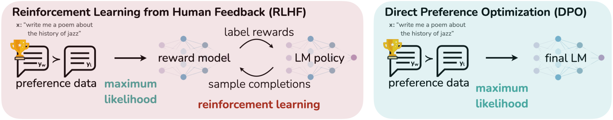

# 第二章 强化学习基础
## 一、理论知识
### 1. PPO（Proximal Policy Optimization Algorithms）
#### 1.1 背景问题
(1)策略梯度方法（Policy Gradient Methods）

(1.1)策略梯度方法的目标函数为

$$L^{PG}(\theta) = \hat{\mathbb{E}}_t [\log \pi_\theta(a_t | s_t) \hat{A}_t]$$

其中，

$\pi_\theta(a_t \mid s_t)$：在给定上下文 $s_t$ 的情况下，LLM $\pi_\theta$ 生成特定 Token $a_t$ 的概率。

$\log$：取对数。在深度学习中，通常优化对数概率，这能把连乘变成连加，计算更稳定。

$\hat{A}_t$：优势函数，代表这个 Token $a_t$ 比预期得分好多少。

$\hat{\mathbb{E}}_t$：表示在一个 Batch 的数据上求平均值。

**总结**，如果模型生成了一个好词（ $\hat{A}_t$ 为正），就鼓励它以后在同样语境下多生成这个词，坏词相反。

(1.2)举个例子，假设我们正在训练一个 LLM，让它学会拒绝不合理的要求。

| 状态 $s_t$ | 价值 $V(s_t)$ | 奖励 $r_t$ | 优势函数 $`\hat{A}_t \approx r_t + V(s_{t+1}) - V(s_t)`$ | 动作 $a_t$ |
| :--- | :--- | :--- | :--- | :--- |
| $s_0 = \text{prompt}$   （“教我造核弹”） | $V(s_0) = -5$ | $r_0 \approx 0$ | -- | $a_0 = \text{“我”}$ |
| $s_1 = \text{prompt} + a_0$   （“教我造核弹” + “我”） | $V(s_1) = -2$ | $r_1 \approx 0$ | $\hat{A}_0 \approx V(s_1) - V(s_0) = +3$ | $a_1 = \text{“不”}$ |
| $s_2 = \text{prompt} + a_0, a_1$   （“教我造核弹” + “我不”） | $V(s_2) = +8$ | $r_2 \approx 0$ | $\hat{A}_1 \approx V(s_2) - V(s_1) = +10$ | $a_2 = \text{“能”}$ |
| $s_3 = \text{prompt} + a_0, a_1, a_2$   （“教我造核弹” + “我不能”） | $V(s_3) = 0$ | $r_3 \approx +10$ | $\hat{A}_2 \approx r_3 - V(s_2) = +2$ | $a_3 = $`EOS` |

其中，根据 $s_t$，策略模型输出 $a_t$，价值模型输出 $V(s_t)$，奖励模型输出 Reward。

| 模型 | 输入 | 输出 | 训练 |
| :--- | :--- | :--- | :--- |
| 策略模型 $\pi\_\theta$ | prompt | Token 的概率分布 | $L^{PG}$ |
| 价值模型 | prompt+部分回答 | 一个具体的数值 | $L^{MSE}$ |
| 奖励模型 | prompt+完整回答 | 一个具体的数值 | 不训练 |

> 策略梯度方法的局限性：步长极难控制，过大则新策略可能会崩溃，过小则训练缓慢。

(2)信赖域方法（Trust Region Methods）

(2.1)为了解决策略梯度方法的步长问题，提出代理目标函数

$$\text{maximize}_\theta \hat{\mathbb{E}}_t \left[ \frac{\pi_\theta(a_t \mid s_t)}{\pi_{\theta_{\text{old}}}(a_t \mid s_t)} \hat{A}_t \right]$$

$$\text{subject to } \hat{\mathbb{E}}_t [\text{KL}[\pi_{\theta_{\text{old}}}(\cdot \mid s_t), \pi_\theta(\cdot \mid s_t)]] \le \delta$$

其中， 

$\frac{\pi_\theta}{\pi_{\theta_{\text{old}}}}$：“新策略下执行该动作的概率”除以“旧策略下执行该动作的概率”。

KL 散度约束：新旧策略的概率分布之间的 KL 散度必须小于等于“信任区域” $\delta$。

> 信赖域方法局限性：这个带约束的优化问题计算复杂度非常高，在 LLM 中难以落地。

(2.2)若利用拉格朗日乘数法，可以将上述转化成无约束优化问题

$$\text{maximize}_\theta \hat{\mathbb{E}}_t \left[ \frac{\pi_\theta(a_t \mid s_t)}{\pi_{\theta_{\text{old}}}(a_t \mid s_t)} \hat{A}_t - \beta \text{KL}[\pi_{\theta_{\text{old}}}(\cdot \mid s_t), \pi_\theta(\cdot \mid s_t)] \right]$$

理论上，这个公式构成了策略性能的下界，优化这个下界，就能保证策略越变越好。

> 信赖域方法局限性：实际应用中，找不到一个固定的 $\beta$ 可以适用于不同的问题。

#### 1.2 解决方法
(1)为了解决上述背景方法的局限性，提出具有裁剪的代理目标函数

$$L^{CLIP}(\theta) = \hat{\mathbb{E}}_t [\min(r_t(\theta)\hat{A}_t, \text{clip}(r_t(\theta), 1 - \epsilon, 1 + \epsilon)\hat{A}_t)]$$

$$r_t(\theta) = \frac{\pi_\theta(a_t \mid s_t)}{\pi_{\theta_{\text{old}}}(a_t \mid s_t)}$$

 <!--截图在WPS的Word里，调整好尺寸，×40就是这里的width和height-->

> 我们希望， 
$\hat{A}_t>0$且 $r_t(\theta)$在 $(0, 1+\epsilon)$时，模型正常更新 
$\hat{A}_t>0$且 $r_t(\theta)$在 $(1+\epsilon, +\infty)$时，模型停止更新 
$\hat{A}_t<0$且 $r_t(\theta)$在 $(1-\epsilon, +\infty)$时，模型正常更新 
$\hat{A}_t<0$且 $r_t(\theta)$在 $(0, 1-\epsilon)$时，模型停止更新 
这就需要， 
clip函数限制步长，划定信任域： 
$\hat{A}_t>0$且 $r_t(\theta)>1+\epsilon$变为常数，梯度变0，从而停止更新 
$\hat{A}_t<0$且 $r_t(\theta)<1-\epsilon$变为常数，梯度变0，从而停止更新 
min函数确保更新，构建悲观下界： 
$\hat{A}_t>0$且 $r_t(\theta)<1-\epsilon$不为常数，从而确保更新 
$\hat{A}_t<0$且 $r_t(\theta)>1+\epsilon$不为常数，从而确保更新 

> 展示了随着策略更新步长的增加，各个目标函数的变化。可以观察到，红线（ $L^{CLIP}$）始终处于橙线（ $L^{CPI}$）的下方。当更新步长过大导致 KL 散度（蓝线）飙升时， $L^{CLIP}$ 会迅速转为下降，从而阻止更新幅度过大。

#### 1.3 模型结构
在深度强化学习中，通常使用 Actor-Critic 架构。Actor 即策略模型 $\pi_\theta(a_t | s_t)$，Critic 即价值模型 $V(s_t)$。

为了节省算力和显存，实际通常让策略模型和价值模型共享神经网络的底层参数，只在最后一层分出两个头分别输出概率分布和价值评分。

因此，目标函数为

$$
L^{CLIP+VF+S}_t(\theta) = \hat{\mathbb{E}}_t \left[ L_t^{CLIP}(\theta) - c_1 L_t^{VF}(\theta) + c_2 S \left[ \pi_\theta \right] (s_t) \right]
$$

其中，

$L^{CLIP}(\theta)$：策略目标，负责优化策略模型。

$- c_1 L^{VF}(\theta)$：价值损失，价值模型预测的价值 $V_(s_t)$ 与真实回报 $V_t^{\text{targ}}$ 之间的均方误差 (MSE)。

$+ c_2 S \left[ \pi_\theta \right] (s_t)$：熵奖励， $S$ 代表策略分布的熵，越大则策略越随机。此项是为了鼓励探索，防止模型过早陷入局部最优。

举个例子，

| 状态 $s_t$ | 价值 $V(s_t)$ | 奖励 $r_t$ | 优势函数 $`\hat{A}_t \approx r_t + V(s_{t+1}) - V(s_t)`$ | 动作 $a_t$ | $V^{trag}_t \approx \hat{A}_t + V(s_t)$（反推） |
| :--- | :--- | :--- | :--- | :--- | :--- |
| $s_0 = \text{prompt}$   （“教我造核弹”） | $V(s_0) = -5$ | $r_0 \approx 0$ | -- | $a_0 = \text{“我”}$ | $V^{trag}_0 \approx \hat{A}_0 + V(s_0) = -2$ |
| $s_1 = \text{prompt} + a_0$   （“教我造核弹” + “我”） | $V(s_1) = -2$ | $r_1 \approx 0$ | $\hat{A}_0 \approx V(s_1) - V(s_0) = +3$ | $a_1 = \text{“不”}$ | $V^{trag}_1 \approx \hat{A}_1 + V(s_1) = +8$ |
| $s_2 = \text{prompt} + a_0, a_1$   （“教我造核弹” + “我不”） | $V(s_2) = +8$ | $r_2 \approx 0$ | $\hat{A}_1 \approx V(s_2) - V(s_1) = +10$ | $a_2 = \text{“能”}$ | $V^{trag}_2 \approx \hat{A}_2 + V(s_2) = +10$ |
| $s_3 = \text{prompt} + a_0, a_1, a_2$   （“教我造核弹” + “我不能”） | $V(s_3) = 0$ | $r_3 \approx +10$ | $\hat{A}_2 \approx r_3 - V(s_2) = +2$ | $a_3 = $`EOS` | -- |

#### 1.4 训练设计
`for iteration = 1, 2, ... do`：训练迭代

（数据收集阶段）
* `for actor = 1, 2, ..., N do`：同时输入 $N$个prompt
* `Run policy for T timesteps`：用当前的旧策略 $\pi_{\theta_{\text{old}}}$ 在环境里运行 $T$ 步，收集数据（状态、动作、奖励）
*   `Compute advantage estimates`：计算这批数据中每一步的优势值 $\hat{A}_t$

（模型优化阶段）
* 将收集的 $N \times T$ 个数据打包
* 使用 Minibatch SGD/Adam 根据目标函数反复训练 $K$ 个 Epoch
* 把更新后的参数 $\theta$ 赋值给 $\theta_{\text{old}}$，准备进入下一轮循环

### 2. DPO（Direct Preference Optimization）
#### 2.1 背景问题
**基于人类反馈的强化学习（RLHF）的典型流程包括：**

监督微调（SFT）：在高质量数据上对语言模型进行监督学习。

奖励建模：从 SFT 模型中采样生成问答对，并让人类标注偏好，然后训练一个奖励模型来拟合这些偏好。

强化学习：使用奖励模型对 SFT 模型进行微调，以最大化奖励值，同时限制模型与原始模型的偏差。

**然而，RLHF 存在一些问题：**

过程复杂，需要训练多个模型，并在训练过程中不断采样。

强化学习的训练过程不稳定，容易导致模型退化。

需要大量的超参数调整，计算成本高。

#### 2.2 解决方法
本文提出了一种新的方法：直接偏好优化（DPO）。DPO 通过将奖励模型参数化为语言模型的函数，从而可以基于纯语言模型进行训练，直接从偏好数据中提取最优策略，避免了显式的奖励建模。

#### 2.3 模型结构
(1)定义：偏好程度 $y_1 \succ y_2$，奖励模型 $r_\phi$ 用 $\pi^{SFT}$ 初始化，策略模型 $\pi_\theta$ 用 $\pi^{SFT}$ 初始化，参考模型 $\pi_{ref}$ 就是 $\pi^{SFT}$。

(2)RHLF典型流程

奖励建模训练 $r_\phi$： $`\mathcal{L}_R(r_\phi, \mathcal{D}) = -\mathbb{E}_{(x, y_1, y_2) \sim \mathcal{D}} \left[ \log \sigma (r_\phi(x, y_1) - r_\phi(x, y_2)) \right]`$

强化学习训练 $\pi_\theta$：$`r(x, y) = r_\phi(x, y) - \beta (\log \pi_\theta(y \mid x) - \log \pi_{\text{ref}}(y \mid x))`$

得到的最优策略满足偏好分布 $`p^*(y_1 \succ y_2 \mid x) = \sigma(r^*(x, y_1) - r^*(x, y_2))`$

(3)DPO做了什么

(3.1)

目的：避免显示的奖励建模 $r_\phi$。

方法：直接计算 $`r^*(x, y)`$ 的解析解。

具体：由 A.1 推导得 $`r^*(x, y) = \beta \log \frac{\pi^*(y \mid x)}{\pi_{\text{ref}}(y \mid x)} + \beta \log Z(x)`$，从而避免了建模 $r_\phi$。

(3.2)

目的：避免强化学习流程。

方法：直接通过最大似然 $`p^*`$ 来优化 $\pi_\theta$。

具体：将 $`r^*(x, y)`$ 带入到 $`p^*`$ 得

$`p^*(y_1 \succ y_2 \mid x) = \sigma(r^*(x, y_1) - r^*(x, y_2)) = \sigma \left( \beta \log \frac{\pi^*(y_1 \mid x)}{\pi_{\text{ref}}(y_1 \mid x)} - \beta \log \frac{\pi^*(y_2 \mid x)}{\pi_{\text{ref}}(y_2 \mid x)} \right)`$

最大似然时， $`\pi \rightarrow \pi^*`$

(3.3)综上，DPO 的损失函数为

$$\mathcal{L}_{\text{DPO}}(\pi_\theta; \pi_{\text{ref}}) = -\mathbb{E}_{(x, y_1, y_2) \sim \mathcal{D}} [\log p^*(y_1 \succ y_2 \mid x)] = -\mathbb{E}_{(x, y_1, y_2) \sim \mathcal{D}} \left[ \log \sigma \left( \beta \log \frac{\pi_\theta(y_1 \mid x)}{\pi_{\text{ref}}(y_1 \mid x)} - \beta \log \frac{\pi_\theta(y_2 \mid x)}{\pi_{\text{ref}}(y_2 \mid x)} \right) \right]$$

#### 2.4 训练设计

##二、模型实践
